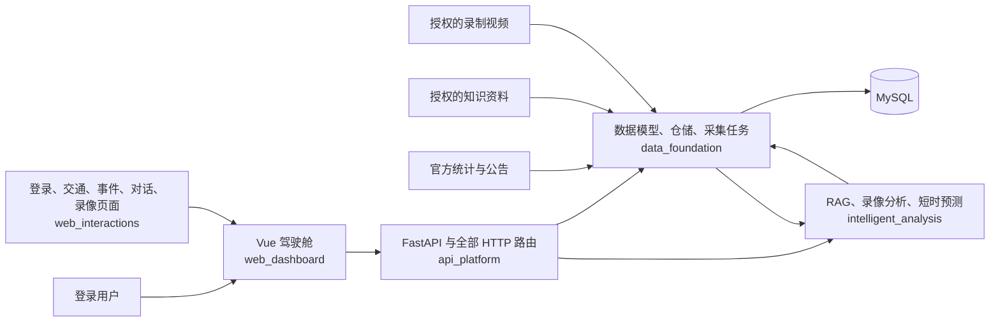
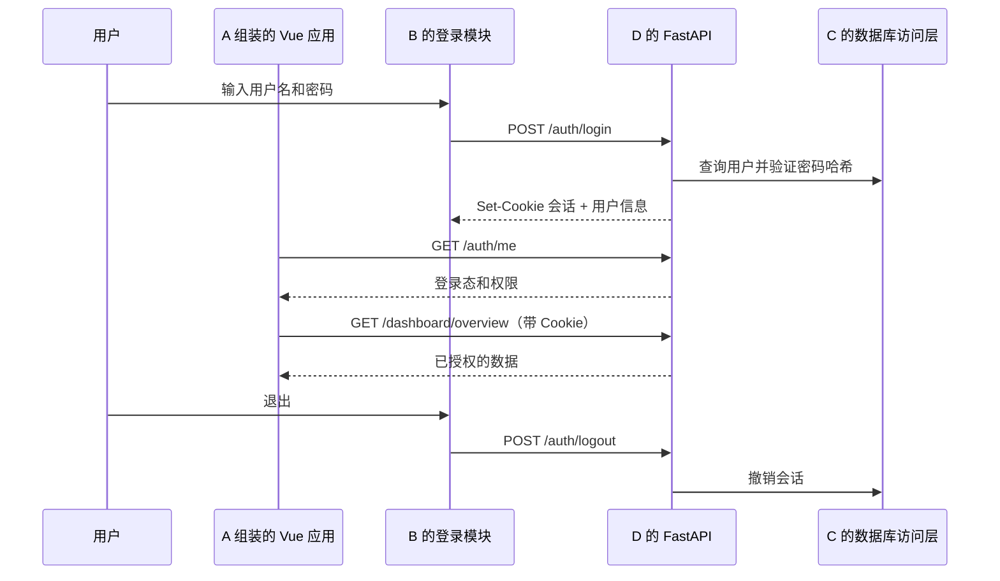

# 项目架构与拟建文件树

> 本文描述未来的代码组织方式。目前只创建了 `项目/` 中的 Markdown 设计文档；下列代码目录与文件尚未搭建。

## 1. 目录归属结论

原方案按 `frontend/`、`backend/` 和 `data/` 分层，A/B 会共同编辑前端目录，C/D/E 会共同编辑后端目录，因此**原文件树不能做到一人一个独占开发目录**。现调整为五个按功能命名的顶层目录：

| 成员 | 独占开发目录 | 目录职责 | 对外集成点 |
|---|---|---|---|
| A | `web_dashboard/` | Vue 应用入口、驾驶舱框架、景区、节假日和图表 | 在应用入口装配 B 导出的模块 |
| B | `web_interactions/` | 登录态、API 客户端、交通、事件、对话和录像页面 | 导出路由、页面、认证状态和客户端供 A 使用 |
| C | `data_foundation/` | MySQL 模型、迁移、数据访问、来源、采集、定时任务和原始资料台账 | 导出受约束的数据访问函数供 D/E 使用 |
| D | `api_platform/` | FastAPI 入口、全部 HTTP 路由、认证、业务查询、历史预测和部署 | 调用 C 的数据包、E 的服务包 |
| E | `intelligent_analysis/` | RAG、YOLOv8 + OpenVINO 录像计数、入口短时预测 | 导出服务函数供 D 调用 |

**开发边界：**每人只修改自己目录内的代码、配置和测试。B 不修改 A 的 Vue 入口；C/E 不修改 D 的 HTTP 路由。需要跨目录变更时先共同更新接口契约，由目录所有者分别实现。根目录的 Markdown 是团队设计文档，不计作个人功能代码。这样仍是**一个 Vue 应用、一个 FastAPI 应用**，不会出现两套相互独立的登录或 API 服务。

## 2. 系统边界与数据流



- C 每周检查来源；实际新增数据以来源发布频率为准。只有月度数据时仍按月保存。
- D 的历史周/月预测和 E 的入口短时预测使用不同的数据集、模型及评估结果。
- E 的视频流程为：录制视频 → YOLOv8 行人检测 → OpenVINO 推理 → 目标跟踪 → 虚拟线进出计数 → 分钟级计数序列 → 独立短时预测。参照 [OpenVINO 官方人数统计示例](https://github.com/openvinotoolkit/openvino_notebooks/blob/latest/notebooks/person-counting-webcam/person-counting.ipynb)；OpenVINO 是推理运行时，并不直接提供客流预测。
- 视频分析只输出指定入口的估计进出人数。录制视频的在线处理可演示算法运行，但页面必须标注“录像回放”，不能标为真实实时客流；单入口数据也不能推导全景区在园人数。
- E 通过 C 的受约束查询获得指标，通过 RAG 获得说明性资料；D 负责认证、权限和 HTTP 响应。

## 3. 登录与权限



- `viewer`：登录后查看数据、事件、智能体回答及获准的录像回放。
- `admin`：除查看外，管理来源导入、事件、知识库资料及视频分析。管理员账户由 D 的离线命令创建，不开放公开注册。
- 用户表只保存密码哈希；会话 ID 存于服务端会话表，浏览器仅持有安全 Cookie。登录失败限速，密码与会话 ID 不写入日志。
- 生产部署使用 HTTPS；对认证后的写接口实施 CSRF token 与同源校验。

## 4. 核心数据表及归属

以下 MySQL 表结构和迁移**均由 C 在 `data_foundation/` 内维护**；D/E 只通过仓储接口访问，不各自定义同名数据表。

| 表 | 核心字段 | 用途 |
|---|---|---|
| `users` | `id, username, password_hash, role, status` | 用户认证与权限 |
| `sessions` | `id_hash, user_id, expires_at, revoked_at` | 服务端会话；仅存会话标识的哈希 |
| `entities` | `id, name, type, region_code, longitude, latitude` | 景区、铁路站、机场和摄像头所属地点 |
| `metrics` | `code, definition, unit, aggregation_rule` | 指标字典和可比性规则 |
| `sources` | `id, publisher, title, url, native_grain, published_at` | 来源与统计口径 |
| `observations` | `entity_id, metric_code, period_start, period_end, grain, value, source_id, quality_status` | 实际客流观测值 |
| `ingestion_runs` | `id, source_id, started_at, status, row_count, error_summary` | 采集与清洗留痕 |
| `holidays` | `id, kind, year, start_date, end_date, definition_source_id` | 节假日专题日历 |
| `events`、`event_history` | `id, kind, authority, status, source_id, starts_at, ends_at` | 官方公告与变化时间线 |
| `forecast_runs`、`forecast_points` | `entity_id, metric_code, model_version, training_end, horizon, error` | 周/月预测和回测结果 |
| `knowledge_documents`、`knowledge_chunks` | `source_url, published_at, valid_until, index_version` | RAG 可引用资料 |
| `videos`、`video_analyses` | `recorded_start_at, camera_id, permission_record_id, detector_model_version, openvino_version, device, count_line, entry_side` | 录像来源与可复现的计数配置 |
| `camera_counts` | `analysis_id, window_start, window_end, entries, exits, quality_status` | 指定入口的录像计数 |
| `short_forecast_runs` | `analysis_id, cutoff_at, horizon_minutes, model_version, validation_error` | 录像短时预测 |
| `jobs` | `id, type, status, started_at, finished_at, error_summary` | 异步任务状态 |

`observations`按对象、指标、周期起止、粒度和来源建立唯一约束；同一来源修订数据时保留修订记录，不静默覆盖原值。数据库中的原始视频路径只供授权服务使用。

MySQL 统一使用 `utf8mb4`；时间在数据库中按 UTC 保存，接口按约定输出带时区的 ISO 8601 时间。迁移脚本和查询以 MySQL 为目标编写，数据库连接信息从环境变量读取，不写入仓库。正式部署与联调使用相同的迁移版本。

## 5. 拟建完整文件树

以下是**规划目录**，不是已创建的代码。正式实施时按依赖和交付阶段逐步创建；空目录不必提前生成。注释中的 A—E 仅说明责任人，实际子目录均采用功能英文命名。

```text
数字媒体/                                  # 当前工作区
├─ 项目/
│  ├─ README.md                           # 已创建：团队设计文档
│  ├─ 01-团队分工总览.md                   # 已创建
│  ├─ 02-个人分工与验收要求.md             # 已创建
│  ├─ 03-接口总览.md                       # 已创建
│  ├─ 04-项目架构与文件树.md               # 已创建
│  │
│  ├─ web_dashboard/                      # A 独占：唯一 Vue 应用与驾驶舱
│  │  ├─ .gitignore                       # 忽略 node_modules 与构建产物
│  │  ├─ package.json                     # 依赖 ../web_interactions 本地包
│  │  ├─ pnpm-lock.yaml
│  │  ├─ index.html
│  │  ├─ vite.config.ts                   # 本机开发将 /api/v1 代理到 FastAPI
│  │  ├─ tsconfig.json
│  │  ├─ public/geo/anhui.geojson         # 核验授权后的地图边界
│  │  ├─ src/
│  │  │  ├─ main.ts                       # 唯一前端入口
│  │  │  ├─ App.vue
│  │  │  ├─ app/router.ts                 # 装配 A 页面与 B 导出路由
│  │  │  ├─ app/route_guard.ts            # 使用 B 导出的登录态
│  │  │  ├─ features/dashboard/
│  │  │  │  ├─ DashboardView.vue
│  │  │  │  └─ overview.ts
│  │  │  ├─ features/scenic/
│  │  │  │  ├─ ScenicView.vue
│  │  │  │  └─ scenic.ts
│  │  │  ├─ features/holidays/
│  │  │  │  ├─ HolidayView.vue
│  │  │  │  └─ holidays.ts
│  │  │  ├─ components/layout/
│  │  │  │  ├─ DashboardShell.vue
│  │  │  │  └─ MetricCard.vue
│  │  │  ├─ components/charts/
│  │  │  │  ├─ TrendChart.vue
│  │  │  │  ├─ ForecastChart.vue
│  │  │  │  └─ HolidayCompareChart.vue
│  │  │  ├─ components/map/AnhuiMap.vue
│  │  │  ├─ styles/tokens.css
│  │  │  └─ styles/global.css
│  │  └─ tests/                            # A 页面的必要交互验收
│  │
│  ├─ web_interactions/                   # B 独占：可被 Vue 应用装载的本地包
│  │  ├─ .gitignore                       # 忽略本包依赖与构建产物
│  │  ├─ package.json                     # Vue/Router 作为 peerDependencies
│  │  ├─ tsconfig.json
│  │  ├─ src/
│  │  │  ├─ index.ts                      # 导出页面路由、认证状态、API 客户端
│  │  │  ├─ api/
│  │  │  │  ├─ client.ts                  # Cookie、CSRF、统一错误处理
│  │  │  │  ├─ auth.ts
│  │  │  │  ├─ transport.ts
│  │  │  │  ├─ events.ts
│  │  │  │  ├─ assistant.ts
│  │  │  │  └─ videos.ts
│  │  │  ├─ auth/
│  │  │  │  ├─ auth_store.ts              # 仅内存持有用户状态与 CSRF token
│  │  │  │  └─ LoginView.vue
│  │  │  ├─ transport/TransportView.vue
│  │  │  ├─ events/
│  │  │  │  ├─ EventView.vue
│  │  │  │  └─ EventList.vue
│  │  │  ├─ assistant/
│  │  │  │  ├─ AssistantView.vue
│  │  │  │  └─ CitationList.vue
│  │  │  ├─ video/
│  │  │  │  ├─ VideoReplayView.vue
│  │  │  │  └─ ReplayCounter.vue
│  │  │  ├─ routes.ts                     # B 页面路由声明，由 A 装配
│  │  │  └─ types/
│  │  │     ├─ api.ts
│  │  │     └─ events.ts
│  │  └─ tests/                            # B 的登录态与页面交互验收
│  │
│  ├─ data_foundation/                    # C 独占：数据包、迁移、采集
│  │  ├─ .gitignore                       # 忽略原始资料、录像和数据库导出文件
│  │  ├─ pyproject.toml                   # Python 包 data_foundation
│  │  ├─ alembic.ini
│  │  ├─ alembic/
│  │  │  ├─ env.py
│  │  │  └─ versions/                     # 唯一数据库迁移位置
│  │  ├─ data_foundation/
│  │  │  ├─ db/
│  │  │  │  ├─ session.py
│  │  │  │  ├─ models/                    # 与第4节数据表对应
│  │  │  │  └─ repositories/              # 面向 D/E 的受约束访问层
│  │  │  ├─ ingestion/
│  │  │  │  ├─ registry.py
│  │  │  │  ├─ fetch.py
│  │  │  │  ├─ normalize.py
│  │  │  │  └─ quality.py
│  │  │  ├─ scheduling/
│  │  │  │  ├─ weekly_check.py
│  │  │  │  └─ ingestion_task.py
│  │  │  └─ provenance/
│  │  │     ├─ source_registry.py
│  │  │     └─ permission_records.py
│  │  ├─ assets/
│  │  │  ├─ source_registry.yaml         # 来源台账，不含密钥
│  │  │  ├─ metric_dictionary.yaml       # 指标与聚合规则
│  │  │  ├─ holiday_calendar.yaml        # 假期定义
│  │  │  ├─ raw/                         # 原始数据，按授权决定是否入库
│  │  │  ├─ processed/                   # 清洗结果
│  │  │  ├─ knowledge_sources/           # 授权资料原件
│  │  │  └─ video_sources/               # 授权录像与人工标注，默认不入 Git
│  │  └─ tests/                            # 幂等导入、口径、权限数据测试
│  │
│  ├─ api_platform/                       # D 独占：唯一 FastAPI 应用和 HTTP 层
│  │  ├─ .gitignore                       # 忽略密钥、本地环境及日志
│  │  ├─ pyproject.toml                   # 安装 ../data_foundation 与 ../intelligent_analysis
│  │  ├─ .env.example                     # MySQL 连接等配置模板，不含真实密钥
│  │  ├─ app/
│  │  │  ├─ main.py                       # 唯一后端入口
│  │  │  ├─ worker.py                     # 本机单独启动的后台作业入口
│  │  │  ├─ core/
│  │  │  │  ├─ config.py
│  │  │  │  ├─ security.py                # 密码、会话、CSRF
│  │  │  │  ├─ permissions.py
│  │  │  │  └─ errors.py
│  │  │  ├─ api/v1/
│  │  │  │  ├─ router.py
│  │  │  │  ├─ auth.py
│  │  │  │  ├─ catalog.py
│  │  │  │  ├─ scenic.py
│  │  │  │  ├─ transport.py
│  │  │  │  ├─ dashboard.py
│  │  │  │  ├─ analytics.py
│  │  │  │  ├─ forecasts.py
│  │  │  │  ├─ holidays.py
│  │  │  │  ├─ events.py
│  │  │  │  ├─ assistant.py              # 调用 E 的 agent 服务
│  │  │  │  ├─ knowledge.py              # 调用 E 的 RAG 服务
│  │  │  │  ├─ videos.py                 # 调用 E 的视觉/短时预测服务
│  │  │  │  └─ jobs.py                   # 调用 C/E 的作业能力
│  │  │  ├─ schemas/                     # HTTP 请求和响应
│  │  │  ├─ services/
│  │  │  │  ├─ auth_service.py
│  │  │  │  ├─ observation_service.py
│  │  │  │  ├─ comparison_service.py
│  │  │  │  ├─ holiday_service.py
│  │  │  │  ├─ event_service.py
│  │  │  │  └─ historical_forecast/
│  │  │  │     ├─ baseline.py
│  │  │  │     └─ backtest.py
│  │  │  └─ telemetry/
│  │  │     ├─ audit.py
│  │  │     └─ logging.py
│  │  ├─ scripts/create_admin.py         # 离线创建管理员
│  │  └─ tests/                            # 认证、权限、接口和历史预测测试
│  │
│  └─ intelligent_analysis/              # E 独占：可被后端调用的服务包
│     ├─ .gitignore                       # 忽略模型权重、索引与推理缓存
│     ├─ pyproject.toml                   # Python 包 intelligent_analysis
│     ├─ intelligent_analysis/
│     │  ├─ agent/
│     │  │  ├─ orchestrator.py
│     │  │  ├─ metric_tools.py           # 使用 C 的白名单查询
│     │  │  └─ citations.py
│     │  ├─ knowledge/
│     │  │  ├─ parse.py
│     │  │  ├─ chunk.py
│     │  │  ├─ index.py
│     │  │  └─ retrieve.py
│     │  ├─ vision/
│     │  │  ├─ video_reader.py           # 录制视频输入
│     │  │  ├─ detector.py               # YOLOv8 人体检测
│     │  │  ├─ openvino_runtime.py       # OpenVINO 模型加载与设备选择
│     │  │  ├─ tracker.py
│     │  │  ├─ line_counter.py           # 指定入口的进出越线计数
│     │  │  └─ validation.py             # 与人工计数比对
│     │  ├─ short_forecast/
│     │  │  ├─ baseline.py
│     │  │  └─ backtest.py
│     │  └─ service.py                    # 向 D 导出稳定服务函数
│     ├─ artifacts/                       # 模型与索引产物，默认不入 Git
│     └─ tests/                            # 引用、计数方向、短时预测测试
└─ tmp/                                    # 与“项目”同级；仅放临时文件并适时清理
```

## 6. 五个目录如何放置与启动（无需 Docker）

五人交付后，将各自目录直接放在同一个 `项目/` 下，保持同级：

```text
项目/
├─ web_dashboard/           # A：唯一 Vue 应用
├─ web_interactions/        # B：被 A 引用的前端功能包
├─ data_foundation/         # C：MySQL 表、迁移和数据包
├─ api_platform/            # D：唯一 FastAPI 应用和作业入口
└─ intelligent_analysis/    # E：被 D 调用的智能分析包
```

B、C、E 的目录**不用分别启动服务**。A 在 `web_dashboard/package.json` 中引用同级的 `web_interactions/`；D 在 `api_platform/` 的 Python 环境中安装同级的 `data_foundation/` 和 `intelligent_analysis/`。运行前，本机需安装并启动 MySQL，准备 Python、Node.js 和 pnpm；将 MySQL 连接地址等本地配置写入 `api_platform/.env`（由 `.env.example` 复制），C 的迁移和 D 的后端读取同一配置。

以下命令从当前工作区（`项目/` 的上一级）开始，适用于 Windows PowerShell。**目前只有设计文档，须等五个目录中的代码完成后才能运行。**

**首次准备后端与数据库：**

```powershell
cd 项目\api_platform
python -m venv .venv
.\.venv\Scripts\python.exe -m pip install -e ..\data_foundation -e ..\intelligent_analysis -e .
cd ..\data_foundation
..\api_platform\.venv\Scripts\python.exe -m alembic upgrade head
cd ..\api_platform
.\.venv\Scripts\python.exe scripts\create_admin.py
```

**启动后端：**在 `项目/api_platform/` 打开两个终端，分别运行 API 和后台作业进程。作业进程用于每周更新、知识库索引和录像分析。

```powershell
.\.venv\Scripts\python.exe -m uvicorn app.main:app --reload --port 8000
```

```powershell
.\.venv\Scripts\python.exe -m app.worker
```

**启动前端：**另开终端，在 `项目/web_dashboard/` 中运行；安装依赖时会同时引用 B 的本地前端包。

```powershell
pnpm install
pnpm dev
```

A 在 `vite.config.ts` 中将浏览器请求的 `/api/v1` 代理到本机 `http://127.0.0.1:8000`。随后打开 Vite 显示的本地地址登录系统；浏览器只访问前端地址，B 的页面与 E 的能力都通过同一个前后端应用使用。以上是预定的本机启动约定，具体脚本名与配置要在实际开发时按此文件树实现。